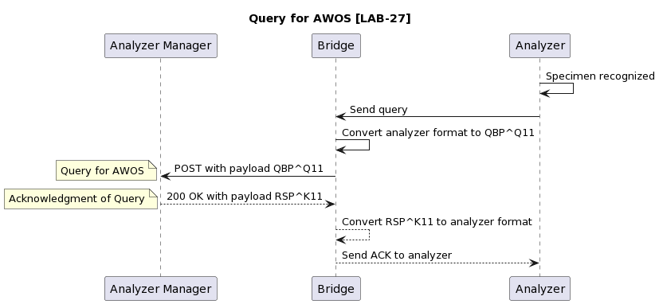
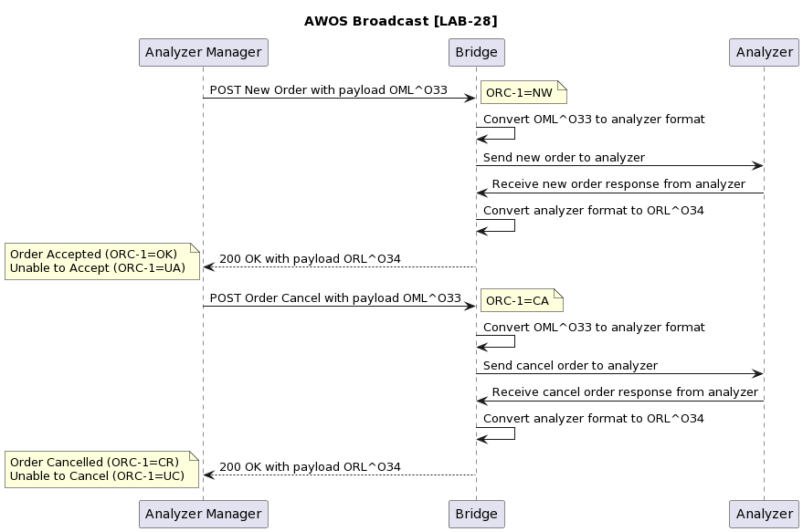
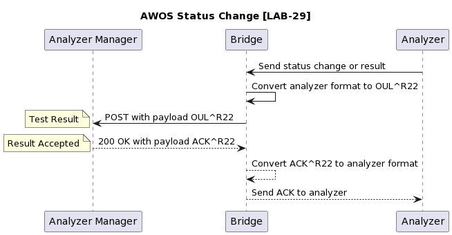

# Context

The LabBook Connect project's first goal is to connect LabBook to analyzers (In Vitro Diagnostic devices),
but its architecture must also allow future data exchanges with other types of healthcare
informatics systems like Electronic Medical Records or Health Management Information Systems.

In this context, the [OpenHIE Framework](https://ohie.org/framework/) seems a good starting point with a modular standards-based architecture.
Following these guidelines, the LabBook Connect project is planned to leverage the following components:

- a FHIR server to store the information exchanged between systems,
- a middleware component for routing, orchestrating and translating requests between systems

# Connecting to IVD devices

Connections between IVD devices and healthcare informatics systems in clinical laboratories have been in place for years.
Standards are being developped but some of the interactions remain specific.

Connecting various IVD devices to a LIS like LabBook means dealing with at least 2 specific elements:

- managing the physical connection to the analyzer and the messages and workflows it implements,
- mapping the various codes used inside the LIS to those of the analyzer.

In this context some unifying efforts seem relevant:

- The [IVD Industry Connectivity Consortium (IICC)](https://ivdconnectivity.org/) is a global, nonprofit organization
dedicated to creating and encouraging adoption of a unified connectivity standard to reduce
the cost and variability of data exchange between IVD devices and healthcare informatics in
clinical laboratories.
It promotes the use of the [IHE-LAW profile](https://wiki.ihe.net/index.php/Laboratory_Analytical_Workflow_Profile)
to define the physical connection, message definitions, and workflow definitions between instruments,
middleware, and LIS systems in the laboratory.
It defines the LIVD digital format for publishing mappings between LOINC and vendor defined tests.
- Decoupled Analyzer Interface System (DAIS platform) is a recent initiative of the
[OpenHIE Lab Information Systems Community](https://wiki.ohie.org/display/CP/Lab+Information+Systems+Community)
which aims to create a community-built and supported software that will connect
to clinical analyzers in the lab via ASTM, HL7 v2, or text file outputs,
and convert them into FHIR objects which any FHIR-ready system can consume,
providing lab results to any system that needs them (LIS, EMR or surveillance system).
It also mentions the [OCL tool](https://openconceptlab.org/) to maintain the concept sets and link to other reference terminologies as needed.
- One of the founding blocks of any communication middleware today is HTTP
so it is worthmentionning the [HL7 over HTTP initiative](https://hapifhir.github.io/hapi-hl7v2/hapi-hl7overhttp/specification.html)
by the [HAPI project](https://hapifhir.github.io/hapi-hl7v2/).

The ideas behind the DAIS platform are fully aligned with the planned architecture for LabBook
Connect, but there is a lot of work to be done to agree upon and to develop a common FHIR-to-analyzer system.
One useful first step could be to develop a minimal HTTP bridge to analyzers, that
would implement the IHE-LAW transactions over HTTP, without any code conversion.

Such a component could be useful as a building block in an orchestrating middleware or as a
standardized access point from a LIS. The necessary mappings between IVD vendor codes and
standard or LIS specific codes will be performed by upstream components in a middleware or by
the LIS itself if it connects directly to the bridge.

The reasons why IHE-LAW is probably the right standard to agree upon for this mininal HTTP
bridge to analyzers are expressed on IICC home page, from which we can cite:

- [LAW] Addresses all the shortcomings of outdated laboratory connectivity standards such as CLSI LIS1-A (ASTM 1391) and CLSI LIS2 (ASTM E1394).
- LAW will be a global standard (CLSI AUTO16).
- [the LAW specification is] available for download and do not require any licensing or fees for implementation.

To the best of our knowledge there is no standard expression of IHE-LAW based on FHIR for the
time being, so we propose to stick to HL7v2 messages. The HL7v2 to FHIR conversion will be
performed by upstream components in the middleware. The extra work of keeping the HL7v2 layer
is justified by the consensus upon IHE-LAW and the time saving and stability it provides.

For analyzers that already implement IHE-LAW the bridge will be very similar to hapi-hl7overhttp.
For the others it will have to manage the conversion to and from the LAW messages and workflow
according to the IVD vendor specifications.

In the following sections we propose sequence diagrams for the HTTP interactions based on the
IHE-LAW profile described in the
IHE PaLM TF Vol1 document (pdf from [IHE](https://www.ihe.net/uploadedFiles/Documents/PaLM/IHE_PaLM_TF_Vol1.pdf))
and transactions described in the IHE PaLM TF Vol2b document
(pdf from [IHE](https://www.ihe.net/uploadedFiles/Documents/PaLM/IHE_PaLM_TF_Vol2b.pdf) or [IICC](https://ivdconnectivity.org/?ddownload=704)).

# IHE-LAW transactions

All the diagrams present the same actors:

- Analyzer represents the IVD device
- Bridge is the HTTP component acting as server and/or client
- Analyzer Manager is the term used in LAW and stands in our case for the upstream middleware or LIS system

AWOS is for “Analytical Work Order Steps”, see §5 of IHE PaLM TF Vol1.

Source code files for the diagrams are in [PlantUML language](https://plantuml.com/en/guide)

The diagram images are created with the online server at [PlantUML website](https://plantuml.com/en/).

## Query for AWOS [LAB-27]

See full description in §3.27 of IHE PaLM TF Vol2b.

In this transaction the bridge transmits the query from the analyzer, it needs an HTTP endpoint tocontact, it will act as the client.

This transaction is used with an Analyzer working in “Query Mode”, it conveys the query and is
combined with AWOS Broadcast [LAB-28], which carries the actual response to the query, as zero or more AWOS.

[LAB-27 diagram source code](lab27.puml).

## AWOS Broadcast [LAB-28]

See full description in §3.28 of IHE PaLM TF Vol2b.

In this transaction the bridge receives new order and cancel order resquests from upstream, it needs
to offer an HTTP endpoint, it will act as the server.

This transaction can be unsolicited if the Analyzer operates in “Broadcast Mode” or in response to a
query initiated via transaction [LAB-27] by the Analyzer operating in "Query Mode".

[LAB-28 diagram source code](lab28.puml).

## AWOS Status Change [LAB-29]

See full description in §3.29 of IHE PaLM TF Vol2b.

In this transaction the bridge transmits the test results and AWOS status changes from the analyzer,
it needs an HTTP endpoint to contact, it will act as the client.

[LAB-29 diagram source code](lab29.puml).

## Summary

The HTTP Bridge converts specific analyzer messages to and from IHE-LAW HL7 messages, and
transports them over HTTP implementing the HL7 over HTTP specification.

It can be implemented as one or several instances of a program acting as an HTTP server with a
lab28 endpoint accepting POST requests and as an HTTP client placing POST requests to lab27 and
lab29 upstream endpoints.

A bridge connected to an analyzer operating in “Query Mode” will use the 3 endpoints.

A bridge connected to an analyzer operating in “Broadcast Mode” will use the lab28 and lab29 endpoints.

# Questions

## Does the bridge need to expose raw messages to and from analyzer for auditing/debug ?

If so simple payloads may be converted to MIME structures to carry the HL7 and the raw messages.
An alternative is to log raw messages, and to implement IHE ATNA Profile transactions to
centralize the logs in the future.

## Is it possible to adapt any specific IVD device workflow to IHE-LAW ?

The HTTP Bridge is based on the assumption that it is possible to adapt any specific IVD device to
the synchronous workflow of IHE-LAW. In particular, when a response is needed from the device,
it has to come within a reasonnable delay.

## The bridge should be able to expose an https endpoint

Either via auto-signed certificates or an imported certificate chain.

## Support additional information in the payload ?

IHE-LAW messages may be insufficient in corner cases. Should we support to carry additional
information to the IHE-LAW messages ? Using MIME structures instead of bare HL7v2 messages ?
